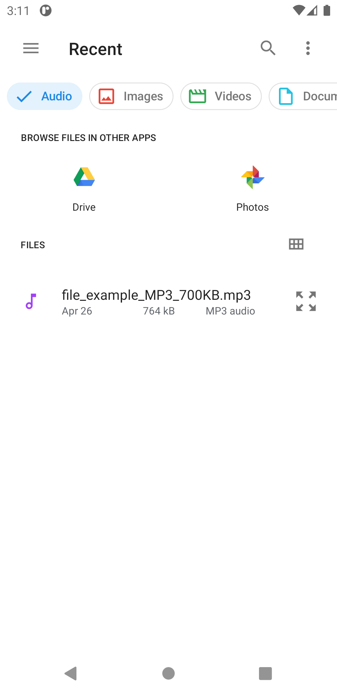
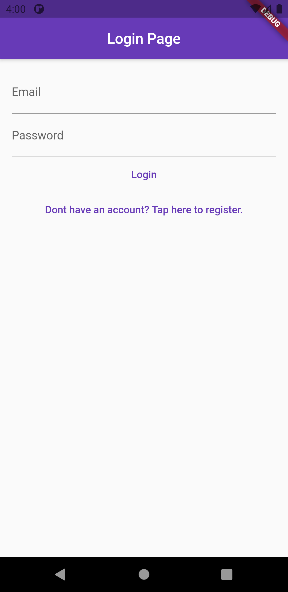
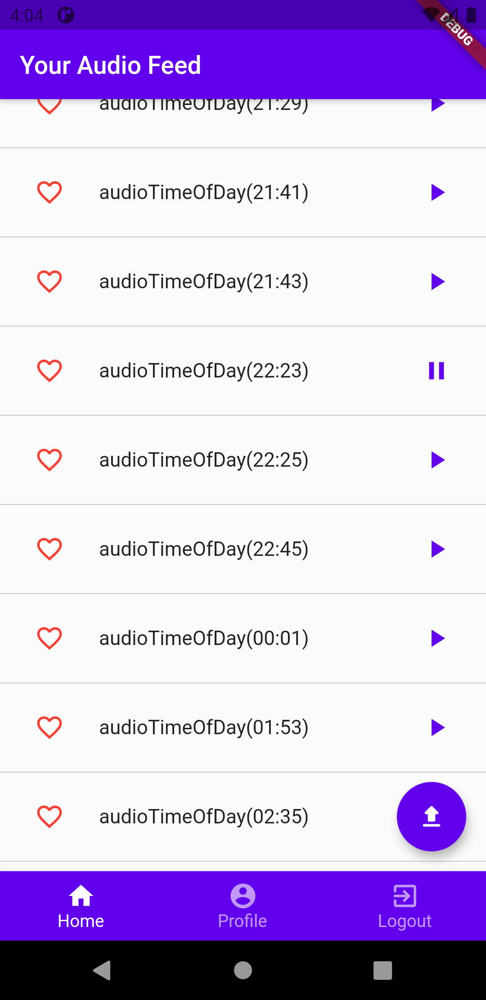

# An Audio App 
Post and listen to music/recordings uploaded by other user .  

Tech used - Flutter , Firebase 

### Features
* Signup/Login
* Upload or Play audio  
* Like Posts 
 
### Installation and Setup

* Fork the repo and clone it.
```
https://github.com/vikiwarrior/Audio-Flutter-App.git
```
* In the same directory run the following commands(considering you have flutter installed and an android device connected)
```
flutter packages get
flutter run
```

### Preview

|  |  |  |
|:--------------------------|:--------------------------|:--------------------------|
|  |  |  |
              
<p align='center'>Made With ❤️ By  <a href="https://github.com/vikiwarrior">Vikrant</a></p>
